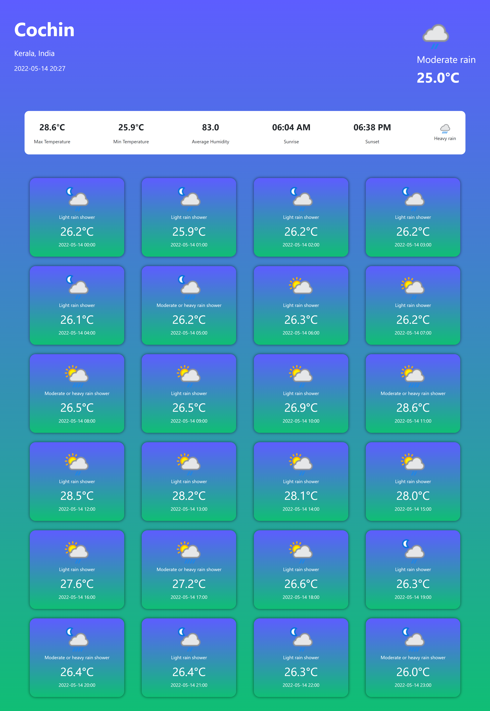

# weather-forecast-app
python Django web app which can show the weather forecast of 24 hours of every cities around the world with beautiful graphic interface.

# tech used
<ul>
  <li><h3>Front end</h3></li>
  <ul>
    <li>HTML</li>
    <li>CSS</li>
    <li>JavaScript</li>
    <li>jQuery</li>
  </ul>
  <li><h3>Back end</h3></li>
  <ul>
    <li>Pyhton Django</li>
  </ul>
  <li><h3>API used:</h3> <a href="https://www.weatherapi.com/">www.weatherapi.com</a></li>
</ul>
<h2>screenshots</h2>

